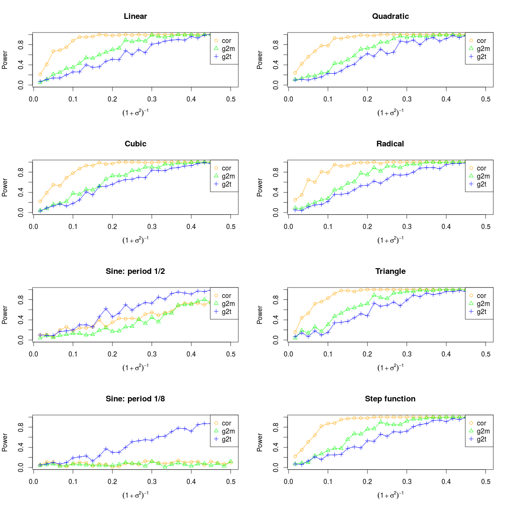

# G-squared

Implementation of Generalized R-squared (**refer to the first reference**)

## Introduction

For `num.noise` noise levels and `num.type` function types, repeat `n1` times under null hypothesis to calculate the rejection cutoffs, then repeat `n2` times under alternative hypothesis to calculate the statistical power.

## Dependencies

1. GNU Scientific Library (GSL)
2. openmp (speed up the program)
3. Rcpp (speed up the original R program)

## Instructions

Make sure you have GSL installed, then run the Makefile
```bash
make
```

you would get the shared library `.so`

Then in the R console, run the R code in [g2_with_extern.R](g2_with_extern.R)

## Plot

Use the following commands to plot like in the original paper. The following code can be directly downloaded from [plot.R](plot.R)

**NOTE:** There are three different ways to deal with the noise. One is to add the noise to the observations before normalization, another one is to add the noise after normalization, while the third one is to combine them. As far as I'm concerned, I prefer to the third ways.

### Way 1


### Way 2


### Way 3

Set the maximum of `x` as 0.2



Set the maximum of `x` as 0.5


## Others

### Compare the results by R and Rcpp

The code is as follows:
```r
library(Rcpp)
N = 1000
Rcpp::sourceCpp("g20.cpp")
x = 1:N
gap = array(NA, c(2, 20))
for (i in 1:20)
{
  y = sin(1:N) + rnorm(N, sd = i)
  df = data.frame(x=x, y=y)
  res1 = g2cpp(df)
  res2 = g2(x, y)
  gap[1, i] = res1$g2m - res2$g2m
  gap[2, i] = res1$g2t - res2$g2t
}
```

We would get the following results


Our original goal is to speed up the program by Rcpp. The following results demonstrate the Rcpp program works!


## Reference
1. Wang, X., Jiang, B., & Liu, J. S. (2017). Generalized R-squared for detecting dependence. Biometrika,​ ​ 104(1),​ ​ 129-139.
2. Simon N. and Tibshirani R. :http://statweb.stanford.edu/~tibs/reshef/script.R
